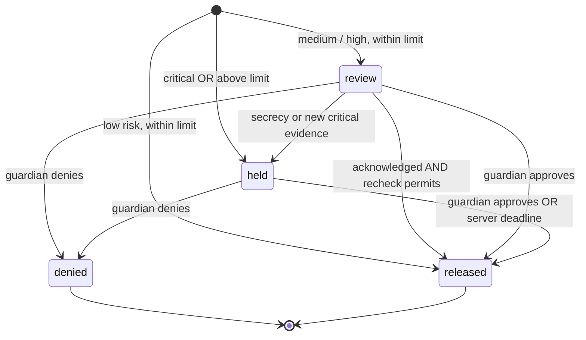

# Tripwire P0 threat model

## Protected boundary

The demo protects the state transition from a mock payment request to its release. The protected user may be convinced by a scammer; the guardian and independently paired relative provide another channel for verification. It does not handle actual money or prevent payments made outside the app.

The server, database, host clock, pairing codes, and the guardian’s device are trusted. A malicious host administrator, stolen pairing code, colluding guardian, or compromised device defeats the corresponding control. No voice authenticity or caller-ID claims are made.

## Attacker-controlled inputs

- Anything a caller says, including instructions directed at the AI.
- Pasted messages, URLs, and image content.
- Payment details and review answers entered by a coached protected user.
- HTTP requests and forged browser state sent without a valid guardian session.

## Controls

| Threat | Control | Remaining limit |
| --- | --- | --- |
| Caller pressures a transfer | Named tells, deterministic risk floor, review step, co-sign limit | Heuristics have false positives and false negatives |
| Caller imitates family | Salted bcrypt safe word, sticky failure, out-of-band callback | Shared secrets can leak; successful verification never means “safe” |
| User changes the browser countdown | Server owns the 24-hour deadline | Host clock must be correct |
| User bypasses a held payment via the review endpoint | Review only accepts `review` state; Critical evidence is rechecked before release | Other financial apps are outside scope |
| User impersonates guardian role | Role-bound signed HttpOnly cookie; server permission checks | Demo mode intentionally permits role selection |
| Replay after denial or approval | Terminal decision checks prevent a second transition | There is no real ledger or settlement network |
| Scammer coaches an immediate limit increase | Limit changes are delayed 24 hours | An authorized user can eventually change their policy |
| Callback recipient sees unrelated data | Server strips transcripts, payments, cases, risk history | The relative still learns that Rosa requested verification |
| Prompt injection in transcript or image | Provider prompt treats content as data; Zod validates shape; AI cannot lower risk or approve | Model advice can still be imperfect; no autonomous tool access is provided |
| URL attempts to reach internal services | Links are never fetched | No reputation lookups or destination analysis |
| Cross-origin mutation | Origin check, SameSite cookies, custom mutation header | Trusted origin compromise is out of scope |
| Excessive guessing or API use | Endpoint and address-based rate limits | Single-process rate limits; not a DDoS protection service |
| Accidental retention | Audio never stored; transcript persistence opt-in; keys/data gitignored | Events, labels, payment records, and opted-in data require a retention policy before real deployment |

## Payment state machine

Approval releases immediately; the timer is an alternative, not an additional requirement. This follows the P0 “approval or cooling-off” rule. A guardian denial permanently cancels that individual mock payment. The protected user can create a new request, but it is scored again.

## Before using with real people or money

Replace demo role selection with proper enrollment and recovery, add household isolation, use a real transactional payment provider, harden policy changes and consent, add retention/deletion and audit controls, independently evaluate detection performance, and obtain appropriate privacy/security review. No legal conclusion about recording consent is built into this prototype.
