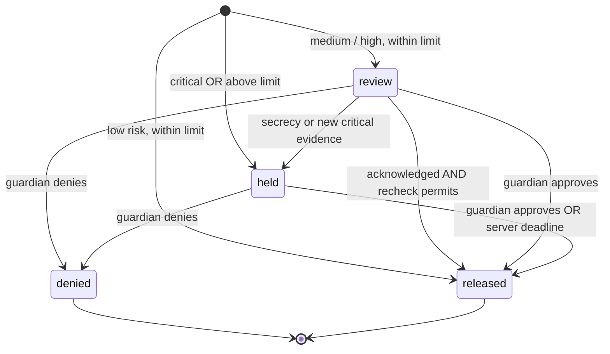

# Tripwire threat model (PRD v2)

## Protected boundary

The demo protects the state transition from a mock payment request to its release. The protected user may be convinced by a scammer; the guardian and independently paired relative provide another channel for verification. It does not handle actual money or prevent payments made outside the app.

The server, database, host clock, pairing codes, and the guardian’s device are trusted. A malicious host administrator, stolen pairing code, colluding guardian, or compromised device defeats the corresponding control. No voice authenticity or caller-ID claims are made.

## Attacker-controlled inputs

- Anything a caller says, including instructions directed at the AI.
- Gemini Live tool calls. They originate from a model that hears the caller and are relayed by Rosa’s browser, so they are untrusted input.
- Payment details and review answers entered by a coached protected user.
- HTTP requests and forged browser state sent without a valid guardian session.

## Controls

| Threat | Control | Remaining limit |
| --- | --- | --- |
| Caller pressures a transfer | Named tells, deterministic risk floor, review step, co-sign limit | Heuristics have false positives and false negatives |
| Caller imitates family (including a perfect voice clone) | Salted bcrypt family word never sent to the model; dodge counts as failure; sticky failure; the impersonated person (Diego) confirms out of band | Shared secrets can leak; a match never means “safe” |
| Prompt injection steers the live agent | Tools are Zod-validated on the server; the model can add evidence, hold, alert, and speak once after Diego replies; it can never release a payment or lower risk; close_case drops quotes never heard on the call | A manipulated model could stay silent, which the deterministic rule spotter and payment rules backstop |
| API key theft from the browser | Browser receives single-use ephemeral Live tokens (1 use, 2-minute start window, 30-minute life) locked to model and config | A token can be replayed within its window by the same browser |
| Family word leaks via the model | Model sends heard_phrase; server compares to the hash and returns only match/no-match; phrase is never logged or stored | The phrase transits Gemini as caller audio, as any spoken word does |
| User changes the browser countdown | Server owns the 24-hour deadline | Host clock must be correct |
| User bypasses a held payment via the review endpoint | Review only accepts `review` state; Critical evidence is rechecked before release | Other financial apps are outside scope |
| User impersonates guardian role | Role-bound signed HttpOnly cookie; server permission checks | Demo mode intentionally permits role selection |
| Replay after denial or approval | Terminal decision checks prevent a second transition | There is no real ledger or settlement network |
| Scammer coaches an immediate limit increase | Limit changes are delayed 24 hours | An authorized user can eventually change their policy |
| Diego’s view sees unrelated data | Server strips transcripts, signals, payments, cases, risk history | Diego learns the alert summary and outcome |
| Cross-origin mutation | Origin check, SameSite cookies, custom mutation header | Trusted origin compromise is out of scope |
| Excessive guessing or API use | Endpoint and address-based rate limits | Single-process rate limits; not a DDoS protection service |
| Accidental retention | Audio never stored; transcript persistence opt-in; keys/data gitignored | Events, labels, payment records, and opted-in data require a retention policy before real deployment |

## Payment state machine

Approval releases immediately; the timer is an alternative, not an additional requirement. This follows the P0 “approval or cooling-off” rule. A guardian denial permanently cancels that individual mock payment. The protected user can create a new request, but it is scored again.

## Before using with real people or money

Replace demo role selection with proper enrollment and recovery, add household isolation, use a real transactional payment provider, harden policy changes and consent, add retention/deletion and audit controls, independently evaluate detection performance, and obtain appropriate privacy/security review. No legal conclusion about recording consent is built into this prototype.
